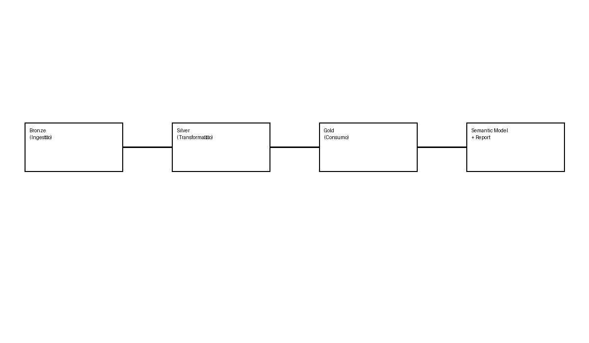

# 📦 Documentação Completa - Workspace Fabric (Gapminder / World Data Bank)

---

## 📁 1. Visão Geral

Workspace Fabric estruturado segundo a arquitetura **Medallion (Bronze → Silver → Gold)**.

```
Fonte → Bronze → Silver → Gold → Semantic Model → Report
```

---

## 🧩 2. Diagrama da Arquitetura



---

## 🧱 3. Arquitetura Medallion (Detalhada)

```
           ┌──────────────┐
           │   Fontes     │
           └──────┬───────┘
                  ▼
         ┌──────────────────┐
         │ Bronze           │
         │ Raw data         │
         └──────┬───────────┘
                ▼
         ┌──────────────────┐
         │ Silver           │
         │ Clean + Model    │
         └──────┬───────────┘
                ▼
         ┌──────────────────┐
         │ Gold             │
         │ Business Ready   │
         └──────┬───────────┘
                ▼
         ┌──────────────────┐
         │ Semantic Model   │
         │ + Power BI       │
         └──────────────────┘
```

### Bronze
- Dados brutos
- Sem transformações

### Silver
- Limpeza e normalização
- Criação de dimensões e factos

### Gold
- Dados agregados
- KPIs e métricas

---

## 📊 4. Artefactos de BI

- gapMinder.Report
- gapMinder.SemanticModel

---

## 📓 5. Notebooks

### Bronze
- WorldDataBank_nb_bronze_facts
- WorldDataBank_nb_localizacoes

### Silver
- WorldDataBank_nb_silver_dims
- WorldDataBank_nb_silver_facts
- WorldDataBank_nb_silver_set_import

### Gold
- Preparação final

---

## 🔄 6. Fluxo

1. Ingestão (Bronze)
2. Transformação (Silver)
3. Consumo (Gold)
4. Modelo semântico
5. Relatório

---

## ✅ 7. Boas práticas

- Separação de camadas
- Pipeline claro
- Escalável

